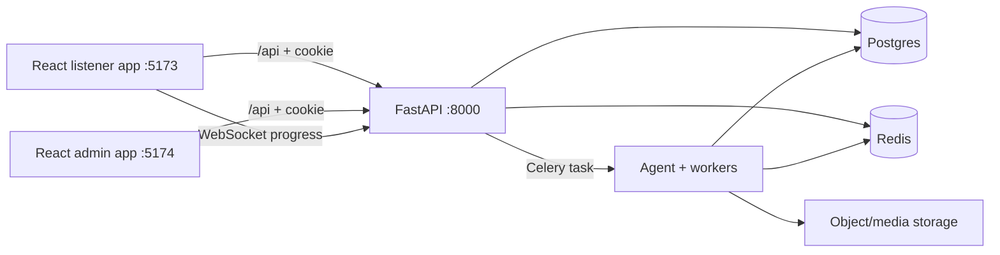

# Daastaan AI — Implementation, API, and Journey Specification

## 1. Product and current implementation

Daastaan turns a user-supplied memory, dream, or idea into a cinematic audio drama. A user can create a story, follow generation progress, listen to generated media, inspect the script, submit feedback, and selectively regenerate the affected part of the pipeline.

The repository is a monorepo:

| Area | Location | Responsibility |
| --- | --- | --- |
| Listener frontend | `apps/web` | Public entry, authentication, library, composition, story studio/playback |
| Operator frontend | `apps/admin` | Admin/operator controls and monitoring UI |
| API | `services/api` | FastAPI auth, story, feedback, media, progress, health, and admin endpoints |
| AI/worker service | `services/agent` | LangGraph reasoning stages, TTS/image tasks, media assembly, Celery workers |
| Shared contracts | `packages/contracts` | Pydantic state models, stage registry, enums, pipeline planning |
| Shared infrastructure | `packages/common` | Database, Redis/Celery, storage, request IDs, middleware, logging |
| Generated TypeScript API helper | `packages/api-types` | `apiFetch`, API errors, session-aware WebSocket helper |

## 2. Architecture and generation flow



`POST /api/stories` creates a `Story` and `StoryVersion`, stores the initial `StoryState` JSON, and dispatches the pipeline. Agent stages rehydrate the state by `version_id`; they do not pass full state through the queue. The generation path is:

```text
story intake → story understanding → character/dialogue/emotion work
→ narrator and voice planning → parallel TTS/image tasks → ffmpeg assembly → episode assets
```

Feedback or explicit regeneration creates a child version and computes only the stages required for the targeted scope. Media asset carry-over and dedupe keys avoid unnecessarily regenerating paid media.

## 3. Listener frontend (`apps/web`)

### Current structure

| File or area | Role |
| --- | --- |
| `src/App.tsx` | Session bootstrap and view router (`landing`, `library`, `compose`, `studio`) |
| `src/api.ts` | Typed client wrapper over `apiFetch`; story and auth API functions; WebSocket/polling progress fallback |
| `src/types.ts` | Listener-side API/view types |
| `src/views/Landing.tsx` | Landing, signup/login, demo access CTA |
| `src/views/Library.tsx` | Authenticated story list |
| `src/views/Compose.tsx` | Story text and genre submission |
| `src/views/Studio.tsx` | Progress, script, player, feedback, regeneration experience |
| `src/components/AppHeader.tsx` | Shared listener header |
| `src/components/AudioPlayer.tsx` | Playback controls/media element |
| `src/components/ProgressStepper.tsx` | Pipeline progress UI |
| `src/components/ScriptPanel.tsx` | Script/line presentation and seeking |
| `src/components/FeedbackComposer.tsx` | Natural-language feedback submission |

Additional design-port components live in `src/components/` and typed mock/service adapters are in `src/services/`. The mainline listener flow uses the real client in `src/api.ts`; retain that as the integration source of truth when extending the active listener UX.

### Listener journey

1. Visitor opens `http://localhost:5173`.
2. The app calls `GET /api/auth/me` to restore an existing cookie session.
3. A new visitor signs up, logs in, or uses the demo-access CTA. The demo CTA uses `demo@daastaan.ai` / `daastaan-demo`; it attempts signup first, then login if the account already exists.
4. On authentication the app calls `GET /api/stories` and opens the Library.
5. **Compose** submits `raw_text` and optional `genre_hint` with `POST /api/stories`.
6. The API returns a story/version/task id. The app opens Studio.
7. Studio reads `GET /api/stories/{story_id}/jobs`, subscribes to `WS /ws/stories/{story_id}`, and polls as a fallback.
8. When assets are ready, the player reads media via `GET /api/media/{asset_id}` with HTTP range support.
9. The user may send feedback or run scoped regeneration; the app refreshes the active version and progress.

## 4. Admin frontend (`apps/admin`)

The admin app is a separate Vite React app on port `5174`. It uses the same cookie-based API session, but server-side admin routes require a user with `role == admin`; hiding UI is not treated as authorization.

Current admin concerns:

- runtime settings and feature/model controls;
- costs by model and pipeline stage;
- user role management;
- story review/flagging;
- pipeline run and audit inspection.

Admin API access is protected by the API dependency `require_admin`. To promote a user in a development database, use the documented operator procedure only after the stack is running.

## 5. API reference

All HTTP endpoints below are prefixed with `/api`, except the WebSocket endpoint. Authentication is an httpOnly session cookie. Errors use FastAPI JSON responses with a `detail` field.

### Health

| Method | Path | Purpose |
| --- | --- | --- |
| GET | `/health` | API liveness |
| GET | `/health/ready` | API, database, and Redis readiness |

### Authentication

| Method | Path | Request | Response |
| --- | --- | --- |
| POST | `/auth/signup` | `{ email, password }` | `UserOut`, sets session cookie |
| POST | `/auth/login` | `{ email, password }` | `UserOut`, sets session cookie |
| POST | `/auth/logout` | — | `204`, clears session cookie |
| GET | `/auth/me` | cookie | current `UserOut` |

### Stories and generation

| Method | Path | Purpose |
| --- | --- | --- |
| POST | `/stories` | Creates a story/version and dispatches generation. Body: `{ raw_text, genre_hint? }` |
| GET | `/stories` | Current user’s story library |
| GET | `/stories/{story_id}` | Current story detail, version state, and media assets |
| GET | `/stories/{story_id}/versions` | Version history |
| GET | `/stories/{story_id}/jobs` | Persisted job progress; includes planned stages |
| POST | `/stories/{story_id}/feedback` | Submits natural-language feedback for interpretation/dispatch |
| POST | `/stories/{story_id}/regenerate` | Scoped regeneration. Body includes `scope`, `target_stage`, optional `target_id`, and `instruction_delta` |
| WS | `/ws/stories/{story_id}` | Live worker progress events; cookie or query token authorization |

### Media

| Method | Path | Purpose |
| --- | --- | --- |
| GET | `/media/{asset_id}` | Streams an authorized media asset and supports HTTP range requests for playback/seeking |

### Studio presentation adapters

The current non-persistent adapters reuse existing job data and intentionally do **not** alter database schema.

| Method | Path | Purpose |
| --- | --- | --- |
| GET | `/observability/jobs` | Current user’s aggregate job observations |
| GET | `/settings` | Non-persistent listener settings defaults |
| PATCH | `/settings` | Non-persistent listener settings preview |

The listener’s active Studio experience uses the canonical story-detail, job-progress, media, feedback, and regenerate endpoints above. Dedicated story-understanding, persona, voice-edit, and episode adapter endpoints should be added only alongside a stable frontend contract and OpenAPI type regeneration.

### Admin (server-side `admin` role required)

| Method | Path | Purpose |
| --- | --- | --- |
| GET | `/admin/settings` | List runtime settings |
| PUT | `/admin/settings/{key}` | Create/update runtime setting |
| GET | `/admin/costs` | Budget and cost rollups |
| GET | `/admin/users` | List users |
| PUT | `/admin/users/{user_id}/role` | Change user role |
| GET | `/admin/stories` | List all stories |
| POST | `/admin/stories/{story_id}/flag` | Flag a story for moderation |
| GET | `/admin/runs` | Pipeline runs, optionally failures only |
| GET | `/admin/audit` | Audit log |

OpenAPI is available at `http://localhost:8000/api/docs`; regenerate the TypeScript API schema with `make types` only while the API is running.

## 6. Local setup and runbook

### Prerequisites

- Node.js/npm
- Python 3.12 and `uv`
- Docker Desktop with Linux engine running **or** local PostgreSQL and Redis
- An `.env` file based on `.env.example`; real AI generation needs `OPENAI_API_KEY`

### Docker path (recommended)

```bash
make setup
make up
make web
make admin
```

- Listener: `http://localhost:5173`
- Admin: `http://localhost:5174`
- API docs: `http://localhost:8000/api/docs`

### Without Docker

Run PostgreSQL and Redis yourself, configure `POSTGRES_MODE=host` and `DATABASE_URL`, then:

```bash
make api
make worker
npm run dev:web
```

The listener cannot authenticate without the API and its database. The frontend alone can render, but `/api` requests will fail if FastAPI is not reachable on port `8000`.

### Verification commands

```bash
npm run build
uv run --no-sync ruff check .
uv run --no-sync pytest -q
curl http://localhost:8000/api/health
curl http://localhost:8000/api/health/ready
```

## 7. Operational guardrails

- Do not call OpenAI directly from arbitrary stages; use `ModelGateway` so costs are recorded.
- Do not create IDs from model output; use shared ID helpers.
- Do not remove media dedupe keys or carry-over behavior.
- Admin permissions must always be enforced by `require_admin` in the API.
- Do not modify `packages/api-types/src/schema.d.ts` manually; it is generated from OpenAPI.
- Do not run destructive volume removal (`make nuke`) for normal local setup.
