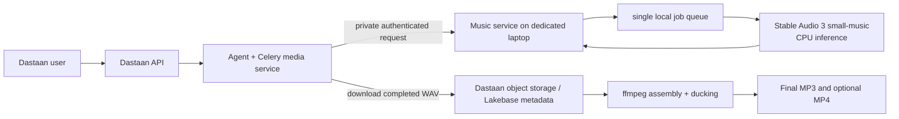
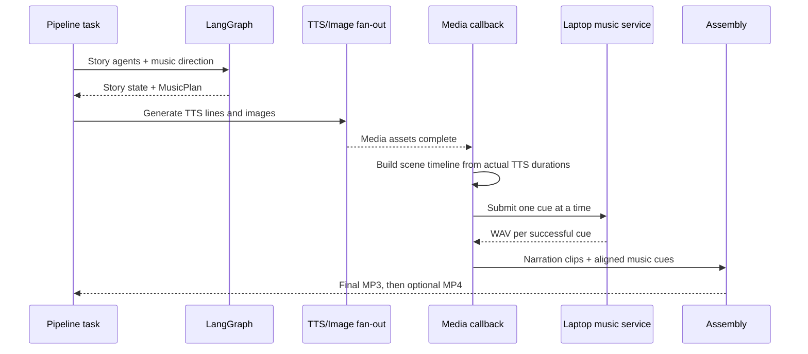

# Local Background-Music Service Specification — Expanded Future Phase

**Status:** retained as the multi-cue roadmap; superseded for the current Mac MVP.
**Historical repository baseline:** `user/daksh` at `a50b7a7` (`chore: video agent`)
**Historical target:** the dedicated Windows laptop (Ryzen 5 5600H, 16 GB RAM, integrated Radeon graphics)
**Audience:** Dastaan AI backend, infrastructure, and QA engineers

> **Current implemented release (2026-07-25):** the 16 GB Apple-Silicon Mac runs
> Stable Audio 3's native MLX `sm-music` + `same-s` runtime behind a private,
> loopback-bound sidecar. Dastaan generates one optional 5–60 second global,
> loopable instrumental bed per story, mixes it below narration, and supports
> music-only feedback/regeneration. The current code and deployment instructions
> are in [the local music sidecar guide](../guides/local-music-sidecar.md).
>
> This document's CPU/Windows, 1–4 cue, post-TTS duration barrier, MusicPlan,
> cue-timeline, sidechain-ducking, scene-cue feedback, and mix-only feedback
> design remains the **next phase**. It must not be read as a description of the
> current implementation.

## 1. Goal

Add background-score generation to a completed Dastaan story. The system must create short, instrumental music cues that match the story's mood and scene arc, mix them under the generated narration, and let a user revise either the music direction, a scene's cue, or the music mix through the existing feedback flow.

The model runs on the dedicated laptop. It is a **private inference worker**, not a public user-facing API. Only Dastaan's agent/media services may submit work to it. The central Dastaan deployment remains responsible for orchestration, object storage, metadata, authentication decisions, and all user-facing responses.

## 2. Historical branch assessment

The updated branch already has useful foundations, but it does not yet generate background music.

| Existing capability | Current state | Required change |
| --- | --- | --- |
| `AssetKind.MUSIC_BED` | Present in the contracts | Use it for each generated music cue. |
| Audio assembly | `compose_episode(clips, music_bed=None)` can mix one optional bed | Replace the single-bed path with a cue timeline and narration ducking. |
| Media asset idempotency | `claim_asset`, `release_claim`, and `record_asset` exist | Claim a music asset once per story version and cue before remote generation. |
| LangGraph story pipeline | Mood, story, characters, dialogue, emotion, narrator persona, and voice assignment are present | Add a music-direction stage; it creates a plan, not audio. |
| Celery media work | TTS and images fan out, then assembly runs | Generate music only after narration durations are known, then assemble. |
| Feedback/regeneration | Line, character, scene, and full-story scopes work | Add music-direction, cue, and mix-only feedback scopes. |
| Video composition | Final video is composed from final MP3 and scene images | It will automatically benefit once the final MP3 contains the music mix. |

There is no current music model service, Celery music task, music-cue contract, music-stage record, or music-specific test coverage. The optional `music_bed` parameter in the current composer is dormant.

## 3. Model decision and laptop fit

Use **Stable Audio 3 `small-music`** for version 1.

It is the best fit for this machine because the 433M-parameter `small-music` checkpoint is designed for local CPU use and produces up to two minutes of 44.1 kHz stereo audio. Dastaan should deliberately constrain production cues to **10–60 seconds** on this laptop for reliability and turnaround time.

The laptop has an AMD integrated GPU with approximately 496 MB visible graphics memory. It does not provide CUDA and should be treated as CPU-only for inference. Do not use ACE-Step as the primary service on this machine: its quality-oriented configurations expect a capable NVIDIA GPU and substantially more dedicated VRAM. Do not use Meta MusicGen for a commercial product unless licensing changes, because its released model weights are non-commercial.

Stable Audio 3 weights are open-weight and commercially usable under Stability AI's Community License for organizations below its stated annual-revenue threshold; Legal must verify that the organization remains eligible before launch. This is not an OSI open-source license.

### Operating limits

| Limit | Initial value | Reason |
| --- | ---: | --- |
| Concurrent inferences per laptop | 1 | Prevents CPU/RAM contention and unpredictable latency. |
| Maximum generated cue duration | 60 seconds | Keeps CPU jobs practical and lets the pipeline recover gracefully. |
| Minimum generated cue duration | 10 seconds | Avoids unusably abrupt musical fragments. |
| Cues per story version | 1–4 | Enough scene variation without overloading the laptop. |
| Music prompt length | 1,000 characters | Avoids accidental prompt bloat and keeps requests auditable. |
| Remote job timeout | 15 minutes | Fail safely rather than holding a Celery worker indefinitely. |
| Job retries | 1 automatic retry, then narration-only fallback | A powered-off laptop must not fail a completed story. |
| Service retention | Delete generated temporary files after central upload; hard maximum 24 hours | The laptop must not become a secondary story store. |

Do not promise a fixed generation latency. Establish real timing during acceptance testing on this specific laptop, with AC power connected and the Windows power profile set to Best performance.

## 4. Architecture



### Trust boundaries

1. The user communicates only with the existing Dastaan API.
2. The central agent/media service is the sole caller of the laptop service.
3. The laptop receives an approved music prompt, cue duration, seed, and opaque request identifiers. It must not receive database credentials, object-store credentials, user sessions, or broad story data.
4. The central service downloads generated WAV bytes and stores them using the existing storage abstraction and `MediaAsset` repository. The laptop never writes to Lakebase or object storage directly.
5. The final mix is made centrally, alongside the existing `pydub`/`ffmpeg` composition process.

## 5. Laptop deployment and private exposure

### 5.1 Recommended deployment shape

Run the music service in a reproducible Linux container through Docker Desktop with WSL2 on the Windows laptop. The container contains the Python runtime, Stable Audio dependencies, FastAPI service, and a single local worker. Persist only these mounted folders outside the container:

- model cache (to avoid repeated multi-GB downloads),
- SQLite job database,
- short-lived generated WAV workspace, and
- structured service logs.

Allocate approximately 10 GB to WSL2/Docker and limit the service to six logical CPUs initially. Leave Windows memory available for the OS. Keep the laptop plugged in, prevent sleep while the service is enabled, and configure container restart-on-failure. These values are starting operational settings, not a performance guarantee; tune after acceptance results.

The service must use one inference process and one FIFO job consumer. A web request must never start model inference directly.

### 5.2 Network topology

Connect the laptop and the central Dastaan environment through a private overlay such as Tailscale or WireGuard.

- Do **not** expose the service through a public IP, router port-forward, public ngrok tunnel, Gradio share link, or public cloud load balancer.
- Bind the API to the laptop's private overlay address, or constrain Windows Firewall inbound rules to the central agent service's overlay address only.
- Allow only `agent-media-service -> music-laptop:8111` in overlay ACLs/firewall rules.
- Keep an optional developer UI, if one is ever added, bound to `127.0.0.1` only. It is not part of production traffic.
- Terminate TLS at a small reverse proxy on the laptop or use the overlay's encrypted transport. For production, prefer both private-network isolation and TLS.

### 5.3 Service authentication

Network isolation alone is insufficient. Each request must include:

- `Authorization: Bearer <MUSIC_SERVICE_TOKEN>`;
- `X-Daastaan-Timestamp` in UTC;
- `X-Daastaan-Signature`, an HMAC-SHA256 signature over HTTP method, path, timestamp, and SHA-256 body hash; and
- a unique `Idempotency-Key`.

The service rejects missing/invalid credentials, timestamps older than five minutes, malformed payloads, and duplicate signatures within the replay window. Store the shared secret only in the central deployment's secret manager and the laptop's protected service environment; never in source control, browser code, logs, Celery payload dumps, or MLflow tags.

## 6. Private music-service API

Version the private API from day one. It should be small and asynchronous.

### `POST /v1/music/jobs`

Submits an approved cue for generation and returns immediately.

```json
{
  "request_id": "opaque UUID from central service",
  "story_version_id": "opaque UUID",
  "cue_id": "music-cue-02",
  "operation": "generate",
  "prompt": "Instrumental cinematic score, warm acoustic strings and soft piano, gentle hopeful rise, no vocals, no speech, no humming.",
  "negative_prompt": "vocals, singing, speech, humming, lyrics, copyrighted melody, artist imitation",
  "duration_ms": 30000,
  "seed": 19428213,
  "idempotency_key": "sha256:..."
}
```

Rules:

- Initially support only `operation: "generate"`. Reserve `continue` and `inpaint` for a later version; do not expose unimplemented modes.
- Require `10,000 <= duration_ms <= 60,000`.
- Accept English music prompts only. The central direction agent must translate intent into English where required.
- Reject prompts that request a living artist's style, lyrics, vocals, speech, or known/copyrighted song reproduction.
- Return `202 Accepted` with `{ "job_id", "status": "queued" }`. The same idempotency key returns the original job rather than creating another inference.

### `GET /v1/music/jobs/{job_id}`

Returns one of `queued`, `running`, `succeeded`, `failed`, or `expired` with a safe progress estimate, creation time, and an error code if relevant. Do not return stack traces, filesystem paths, secrets, or raw prompts to callers.

### `GET /v1/music/jobs/{job_id}/audio`

Available only when status is `succeeded`. Streams the generated `audio/wav` file once to the authenticated central service. Mark the job artifact for deletion after successful retrieval; delete it no later than 24 hours after completion.

### Health endpoints

- `GET /healthz`: process alive, intended for the laptop-local supervisor only.
- `GET /readyz`: model loaded, queue available, disk workspace has capacity. Restrict it with the same network rules; it must not be public.

### Local service state

Use a small local SQLite database with job ID, idempotency key, status, timestamps, model version, seed, requested duration, output hash, and safe failure code. This allows the service to recover queued/completed requests after a restart. Do not persist full story text or user feedback on the laptop.

## 7. Dastaan contracts and pipeline changes

### 7.1 New contracts

Add typed models rather than embedding free-form music objects in `state_json`.

```text
MusicCuePlan
  cue_id: str
  scene_ids: list[str]
  musical_prompt: str
  negative_prompt: str
  energy: int                    # 1..5
  transition: enum               # cut | crossfade | carry
  target_duration_ms: int | null # filled after narration timings exist
  seed: int | null

MusicPlan
  version: int
  overall_direction: str
  cues: list[MusicCuePlan]       # 1..4
  mix: MusicMixSettings

MusicMixSettings
  music_gain_db: float
  ducking_enabled: bool
  fade_in_ms: int
  fade_out_ms: int
  crossfade_ms: int
```

Add `cue_id`, `start_ms`, and `end_ms` to the music-asset metadata/contract. Do not overload the existing single `scene_id` field for a cue that spans multiple scenes. A dedicated cue identifier is required for reliable feedback, idempotency, and assembly.

Add stage values for `MUSIC_DIRECTION`, `MUSIC_GENERATION`, and `MUSIC_MIXING`. `MUSIC_GENERATION` is a media-work stage and may be partially degraded without marking the story generation itself failed.

### 7.2 Music direction LangGraph node

Insert `music_direction` after voice assignment. It uses the existing light structured-output model configuration (currently the GPT-4o-mini class of workload) to produce a `MusicPlan` from:

- classifier genre/mood/tone keywords,
- story arc and settings,
- scene order and emotional movement,
- character/speaker information only when musically relevant, and
- safety constraints for instrumental score.

It must not call the local model and must not create audio. It outputs 1–4 cue plans grouped by story scenes. The plan describes intent before actual narration timing is known.

Prompt rules for the direction node:

- Ask for instrumental score only: no vocals, dialogue, lyrics, speech, or humming.
- Use concrete instrumentation, pacing, intensity, and transition terms.
- Prohibit named artists, named songs, and requests to reproduce recognizable melodies.
- Produce English prompts even when the story/narration language is Indian-language or mixed-language.
- Keep every prompt short enough for the local service contract.

### 7.3 Orchestration sequence

The first implementation should preserve the current Celery fan-out pattern while adding a barrier before music generation.



Detailed flow:

1. `run_pipeline` persists the `MusicPlan` from LangGraph with the story version.
2. Existing TTS and image tasks execute as they do today.
3. The media callback builds the scene timeline from successful TTS clip durations. It fills each cue's `target_duration_ms`, start, and end positions.
4. For each cue, a `generate_music_cue` task calls `claim_asset` using a deterministic cue-specific dedupe key such as `music_bed:<cue_id>`. If the asset already exists, reuse it.
5. The task submits to the private service, polls with bounded exponential backoff until terminal state or the 15-minute timeout, downloads the WAV, validates it, writes it through the existing object store, and records a `MUSIC_BED` `MediaAsset`.
6. The task records generation metadata: model identifier, model version, seed, duration, cue ID, output SHA-256, timing, and zero external provider cost. Never store the shared service secret.
7. Assembly consumes the aligned cue assets and emits the final MP3. The existing video task then receives the improved final MP3 without a separate video design change.

The central Celery task is an adapter/client only. It must not load the local music model. The laptop holds all inference dependencies.

### 7.4 Validation before central storage

Before a downloaded artifact becomes a `MediaAsset`, central code must:

- require `audio/wav` and a conservative maximum byte size;
- run `ffprobe`/equivalent to verify decodable audio, sample rate, channels, and a duration within an allowed tolerance;
- calculate and store SHA-256;
- reject unexpected content types, symbolic archive formats, or files with invalid duration; and
- delete failed temporary downloads.

The stored source cue should remain WAV for quality. The assembled deliverable remains the current MP3/MP4 output format.

## 8. Mixing behaviour

The current one-bed `-stream_loop -1` implementation is an acceptable temporary experiment but is not the production mixer. Production mixing must use cue positions derived from narration, not one endlessly repeated track.

For each cue:

1. place it at the cue's `start_ms` using an explicit audio delay;
2. trim it to the cue window or use a configured fade/crossfade into the next cue;
3. apply the plan's gain and short fades;
4. duck the music dynamically when narration is present; and
5. apply final normalization after narration and music are mixed.

Initial tuning target: background music should sit roughly 16–22 dB under foreground narration, with sidechain compression further reducing music while speech is active. The exact filter graph and gain values must be calibrated with representative Hindi, Telugu, and English narration samples. Speech intelligibility takes priority over dramatic loudness.

If no cue succeeds, assembly must produce the existing narration-only final MP3. If one cue fails, the successful cues are used and the missing window remains quiet; do not loop unrelated music across it without an explicit plan.

## 9. User feedback and regeneration

Extend the feedback interpreter and regeneration directives with three music targets:

| User intent | Internal scope | Action |
| --- | --- | --- |
| “Make the background music calmer throughout.” | `music_direction` | Re-plan and regenerate all cues, then remix. |
| “Change music in the forest scene to be more suspenseful.” | `music_cue` + scene/cue ID | Regenerate only the matching cue, then remix. |
| “Keep the music but make it quieter.” | `music_mix` | Preserve cue assets; change mix settings and reassemble only. |

The feedback interpreter must turn raw user language into a validated structured directive. The local model receives only the resulting safe prompt delta—not untrusted raw feedback. User feedback cannot select arbitrary model operations, arbitrary filesystem paths, an artist/style imitation, or a cue belonging to a different story version.

As with current regeneration, feedback creates a new story version. A mix-only revision must not rerun TTS, image generation, or music inference. A cue-only revision must reuse all unaffected cue assets and narration assets.

## 10. Reliability, observability, and safety

### Graceful degradation

The laptop is a single, non-HA inference node. It may be asleep, offline, thermally throttled, or updating. Therefore:

- If it is unavailable before a cue begins, mark the music operation degraded and continue to narration-only output.
- If a job fails once, retry once using the same idempotency key only when the cause is transport/temporary availability. Do not retry policy, validation, or bad-prompt errors.
- Surface `music_status` (`complete`, `partial`, `unavailable`, or `disabled`) in the final story/job response and UI.
- Do not silently claim “music generated” when fallback output is narration-only.

### Metrics and logs

Track in the central system:

- queue wait, inference duration, download duration, and assembly duration;
- service availability and job success/failure rate;
- cue count, requested/generated seconds, fallback rate, and output validation failures;
- story version, stage, opaque request/cue IDs, and model version; and
- zero external-dollar cost plus local compute duration for operational reporting.

Avoid recording full story text, raw audio, authorization headers, service tokens, or signed URLs in logs, MLflow parameters, or error traces. Use request and cue IDs to correlate central and laptop logs.

### Content and licensing guardrails

The direction and feedback prompts must reject artist imitation, songs/lyrics, recognizable melody reproduction, and speech/vocal requests. Background music is instrumental by product design. Preserve the exact Stable Audio model/version and license acknowledgement with each deployment so generated assets can be traced to the model release used.

## 11. Acceptance and test plan

No production feature flag is enabled until all of the following pass.

### 11.1 Laptop/model acceptance

1. Start the service on AC power with only one inference worker.
2. Generate three 30-second instrumental cues covering calm, suspense, and joyful story moods.
3. Verify each download is valid 44.1 kHz stereo WAV using `ffprobe` or equivalent, listen for accidental speech/vocals, and record actual timing and peak memory.
4. Generate one 60-second cue and confirm the worker remains responsive after completion.
5. Confirm a second simultaneous job queues rather than starting another inference process.

### 11.2 Private-service integration

1. From the authorized Dastaan agent host, submit a valid request, poll it, and download the resulting WAV.
2. Repeat the same request with the same idempotency key and verify only one local job runs.
3. Verify missing/invalid bearer token, bad HMAC, stale timestamp, malformed duration, and artist/lyric prompt are rejected.
4. Verify a non-authorized network client cannot reach port 8111.
5. Restart the container while a job is queued and verify job state recovery or a safe terminal failure—not a duplicated inference.
6. Verify temporary files are removed after central retrieval and by the 24-hour cleanup job.

### 11.3 Central agent tests

Add automated tests using a fake private music service that returns a small known-valid WAV:

- music plan schema validation and direction-node structured output;
- asset claim/dedupe/reuse for one cue;
- successful remote submit, polling, validation, storage, and `MUSIC_BED` record;
- timeout, invalid WAV, and unavailable-service fallback to narration-only;
- timeline placement and ducking filter construction for multiple cues;
- cue-only feedback reuses TTS/unaffected cues; mix-only feedback reuses all audio assets; and
- final MP3 remains decodable and approximately the narration timeline length.

### 11.4 End-to-end acceptance

Create a short multi-scene story through the real Dastaan API with music enabled. Verify:

1. the job reaches a terminal completed or degraded state;
2. Lakebase/object storage has music assets with cue IDs and metadata;
3. the final MP3 contains audible but intelligible background score;
4. the optional MP4 uses the same final MP3;
5. a “quieter music” feedback request causes remix only; and
6. a scene-specific music change regenerates only that cue.

Record test outputs, timings, model version, and human listening results before enabling the feature for broader users.

## 12. Delivery phases

| Phase | Deliverable | Exit condition |
| --- | --- | --- |
| 0 — model proof | Laptop container, private network, manual 30/60-second samples | Model quality, memory, and timing are measured on the actual hardware. |
| 1 — private service | Async API, single-worker queue, auth, SQLite state, cleanup | Unauthorized access is blocked and idempotent jobs work. |
| 2 — central adapter | Contracts, direction node, Celery client, storage/asset records, feature flag defaulting off | Fake-service integration tests pass. |
| 3 — composition and feedback | Timed cue mixer, ducking, music feedback scopes | Cue and mix-only regression tests pass. |
| 4 — controlled launch | Real end-to-end test and monitoring dashboard | Human listening approval and fallback behaviour are verified. |

Recommended feature flags:

- `LOCAL_MUSIC_ENABLED=false` — master switch;
- `LOCAL_MUSIC_SERVICE_URL` — private overlay URL only;
- `LOCAL_MUSIC_MAX_CUES=4`;
- `LOCAL_MUSIC_MAX_DURATION_SECONDS=60`;
- `LOCAL_MUSIC_FALLBACK_TO_NARRATION=true`.

## 13. Explicit non-goals for version 1

- Public/direct user access to the music model.
- Training or fine-tuning a music model.
- Vocal songs, lyric generation, character singing, or speech generation.
- Infinite/long-form music generation beyond the cue limits.
- Automatic artist-style imitation or soundtrack recreation.
- Making the laptop a source of truth for Dastaan media or metadata.
- Replacing the existing TTS, image, video, Lakebase, or MLflow architecture.

## 14. Reference material

- [Stable Audio 3 `small-music` repository](https://github.com/Stability-AI/stable-audio-3) — CPU-oriented local model usage and capabilities.
- [Stable Audio 3 release announcement](https://stability.ai/news-updates/meet-stable-audio-3-the-model-family-built-for-artistic-experimentation-with-open-weight-models) — model family, commercial Community License conditions, and training-data statement.
- [ACE-Step 1.5 repository](https://github.com/ace-step/ACE-Step-1.5) — higher-resource alternative that is not the primary choice for this laptop.
- [AudioCraft weight license](https://github.com/facebookresearch/audiocraft/blob/main/LICENSE_weights) — non-commercial restriction relevant to excluding MusicGen for this product.
